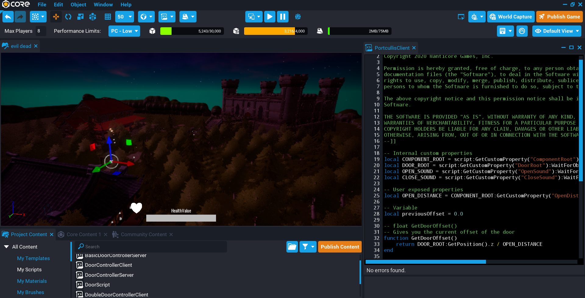
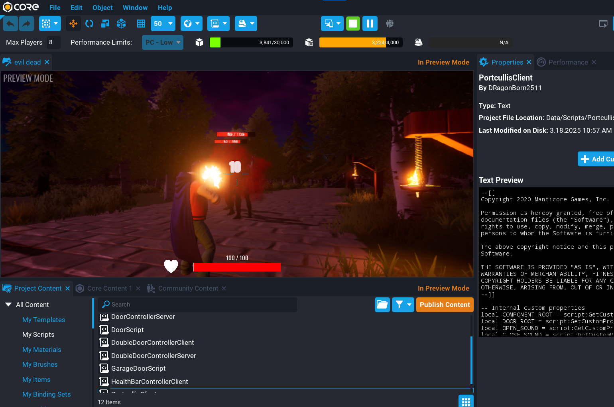

# Evil Dead 🧟‍♂️

**Evil Dead** is a third-person action survival game built using **Core Engine**, where the player battles against waves of undead enemies in a dark fantasy setting. The project demonstrates gameplay scripting, custom UI elements, and Core API usage for health systems, animations, and sound triggers.

---

## 🕹️ Game Overview

- **Genre:** Action / Survival  
- **Engine:** Core by Manticore Games  
- **Mode:** Single Player (Expandable to Multiplayer)  
- **Developer:** Lalith Abhishek , K V Barath , Deepak PS

You play as a heroic survivor fighting to cleanse the cursed woods surrounding a haunted castle. The environment features dynamic lighting, health systems, door mechanics, and scripted sound effects to create a thrilling gameplay experience.

---

## ⚙️ Features

- **Custom Door & Gate System**  
  Uses client-server scripts like `PortcullisClient.lua`, `DoorControllerClient.lua`, and `DoorControllerServer.lua` to manage gate animations and synchronized sound effects.

- **Health Bar System**  
  Real-time player health tracking and display using `HealthBarControllerClient.lua`.

- **Combat Mechanics**  
  The player can shoot enemies, deal damage, and see health feedback on impact.

- **Environment Design**  
  Includes medieval-style assets like castles, torches, and forests designed with lighting for night atmosphere.

---

## 🧩 Scripts Used

| Script Name | Description |
|--------------|-------------|
| `PortcullisClient.lua` | Controls castle gate behavior and sounds. |
| `DoorControllerClient.lua` | Manages client-side door animations. |
| `DoorControllerServer.lua` | Syncs door opening/closing between players. |
| `HealthBarControllerClient.lua` | Displays and updates player health. |
| `DoorScript.lua` | Handles door logic for interaction. |

---

## 🖼️ Screenshots

### Gameplay Environment

### Combat Scene

---

## 🧠 Technical Details

- **Language:** Lua  
- **API Used:** Core Scripting API  
- **Performance Optimization:** Low-performance mode enabled for broader compatibility (PC - Low setting).  
- **Player Limit:** 8 Players  

---

## 🚀 How to Run

1. Open **Core Editor**.  
2. Import or open the project folder named `evil dead`.  
3. Click **Play** (▶️) to run in preview mode.  
4. Use **WASD** to move and **Mouse Click** to attack.  

---

## 📚 Acknowledgements

- **Manticore Games** for the Core Engine  
- **Assets:** Core Content Library  
- **Scripts:** Adapted and customized from Core Community templates  

---

## 🏁 Future Enhancements

- Add multiplayer support  
- Include enemy AI variety and boss fights  
- Implement weapon upgrades and inventory system  
- Add environmental soundscapes and weather effects

---

## 📄 License

This project is created for academic purposes under educational fair use.

---

